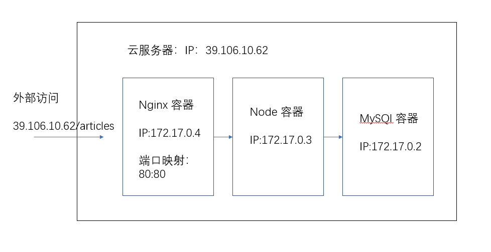

# 部署

部署采用 docker 容器技术。具体结构如下：



### mysql 容器
具体在数据库设计中已说明，需要知道，他的 ip 为 172.17.0.2，然后通过默认的3306端口访问。

### node 容器
我并没有使用原生 node 容器，而是先用一个 centos 容器，然后在这个容器中安装 node 环境，再把这个容器保存为镜像，之后就可以使用这个镜像来生成 node 运行的环境容器。

这个容器 ip 为 172.17.0.3，它可以访问同一局域网下的  mysql 容器，这样就可以对数据库进行操作。编写数据库下的 config.js 文件时要注意他的ip。

在 node 容器中运行这个程序时需要在后台运行。
```
nohup node app.js &
```

### nginx 容器
使用一个 nginx 容器做反向代理。容器80端口映射到主机80端口。

nginx可以简单配置如下，目前主要就是把请求转发到 node 容器上，让 node 程序处理。
```
upstream BSServer {
    server 172.17.0.3:3000;
}
server {
    listen 80;
    location / {
        proxy_pass http://BSServer;
    }
}
```

node 程序运行时监听的是3000端口。仅仅转发，后面可以做更多配置。

