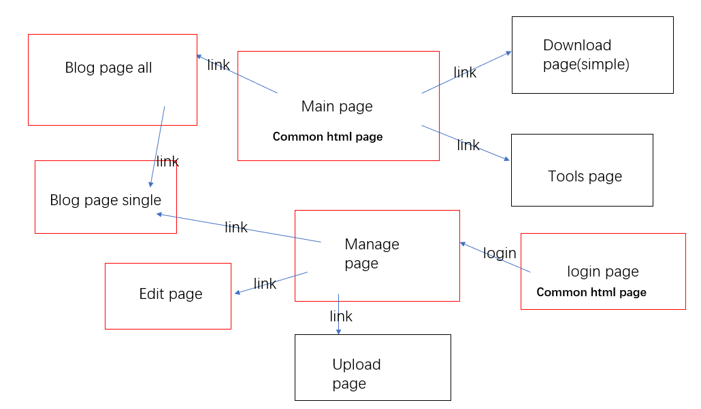

# web 入门（第一个web项目，从后端到前端到部署）——总述
### 个人简介
本人从大三上学期开始开始学习全栈开发，平时就利用课余、周末时间学习js,css,html之类的。现在学了近一个学期，但是感觉自己学的并不是很好，而且也不知道究竟学的怎么样，因此想实战一下，做一个入门级的web应用。于是便想做这个项目，具体如下。

### 项目简介
我自己是购买了一个阿里云的服务器，￥9.9一个月的（学生价），然后之前是在上面用wordpress搭了一个博客平台，但是感觉wordpress不好用（可能是自己还没有深入研究它），于是想自己写一个简易的博客平台，用来放自己的博客文章之类的。

有想法就要行动起来，就开始慢慢做吧！

- 注：这个博客平台是自己根据自己所学已经所了解的来进行搭建的，所有里面的一些设计可能并不是很好，毕竟自己刚入门，有很多地方也确实不知道怎么写，所有各位大佬不要嫌弃我这个小菜鸡，同时也欢迎给我提出各种宝贵意见。

### 整体结构
整个博客平台的功能结构设计如下图：

说明：

- main page,是其他人访问我的服务器时所显示的主页
- blog page all,是通过主页跳转至所有博客页面，向用户显示我所有的博客，在这个界面点击一个博客跳转，即可显示单个博客内容。
- blog page single,即显示单个博客的页面，使用统一模板。
- download page,tools page,这两个页面也是在主界面进行跳转，分别跳转至资源下载界面（我上传一些资源供别人下载）和工具界面（写一些小工具，如进制转化什么的供别人使用）。这两个界面相对独立，实现或不实现都行。
- login page,这个界面提供一个登陆界面，主要是为我自己提供的，以便我登陆后可以进行文章管理。
- manage page,就是管理界面了，对所有文章进行管理，同时在该节目可以跳转至blog page single以查看文章，或者跳转至edit page进行编辑文章。
- edit page,编辑文章界面，可以编辑已经发表的文章，也可以写一篇新文章。
- upload page,一个上传文件的界面，主要是我可能会上传一个媒体文件之类的，也可选择性实现。因为我可以选择直接上传服务器。

前端框架：bulma pug模板引擎
后端(node开发)：express/koa（以后改用）
部署：docker容器 nginx服务器

### 文档目录索引
- 1.[概述](./summary.md)
- 2.数据库
    + 2.1[数据库说明](./db_doc/db.md)
- 3.部署
    + 3.1[部署说明](./deploy_doc/deploy.md)
    

